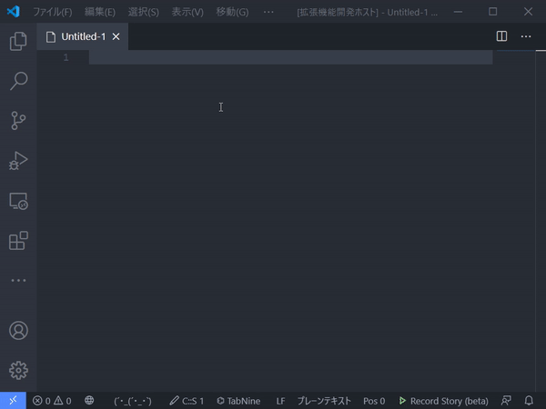

# vscode-random-string

## Features

**vscode-random-string** is an extension to insert a random string from the command palette.
You can configure which characters to use and the length of the string to be inserted.

## License

MIT
